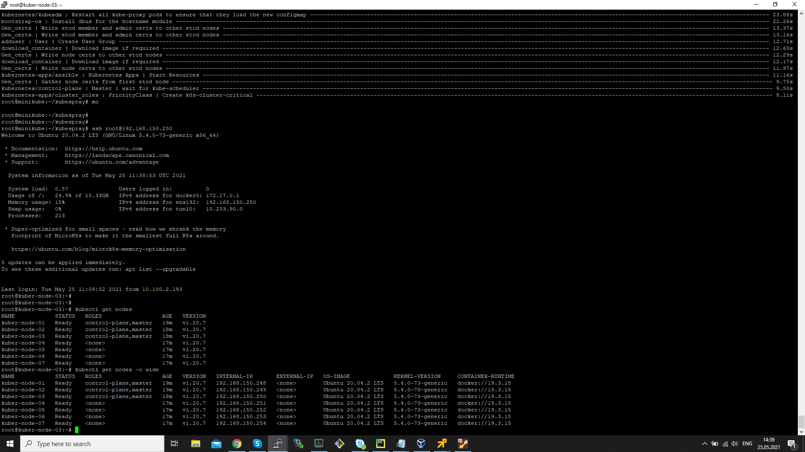

### HW 14

#### Задача по обновлению верссии Kubernetes:

* Т.к. закончились средства на счету yandex-cloud, пришлось развернуть локальный кластер в облаке vSphere, состоящий из 7 нод, конфиргурации 4CPU/8GB RAM/32GB HDD.
  Развёртывание производилось с помощью terraform и cloud-init из общедоступного шаблона Ubuntu 20.04 LTS ubuntu-focal-20.04-cloudimg.ova.
  ```
  # cloud-config

  repo_update: true
  repo_upgrade: all

  packages:
   - python3

  users:
   - name: root
     hashed_passwd: <hashed_password>
     lock-passwd: false
     sudo: ALL=(ALL) NOPASSWD:ALL
     shell: /bin/bash
     ssh_authorized-keys:
      - "ssh-rsa ..."
  ```
  После чего, на рабочую станцию, с которой, в последствии, планировалось производить действия по установке и обновлению kubernetes,
  были импортированы сигнатуры ключей вновь созданных нод кластера.

* Произведена установка сначала в "ручном" режиме, кластера, затем обновление его до версии 1.20.

* После всех верификаций, затронутые ноды были удалены и заново созданы с помощью terraform.  

* Был скачан и сконфигурирован kubespray, после чего была произведена установка kubernetes 1.20 на все ноды кластера (3 ноды control-plane, 5 ноды worker)

* В соотвествии с Заданием, привожу скриншот конечного состояния кластера, после применения роли ansible kubespray с заданной конфигурацией:
  

